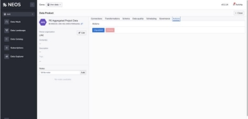

Plan your data landscape

` `The **NEOS Data Landscape** contains your end-to-end flows of data from sources to applications.  By creating a data landscape, you will be able to view your data path from source to destination. This will help you to collaborate with your Data Team and stakeholders. You can start anywhere in the landscape by defining the applications/dashboards or the data sources.  

Prerequisites: 

If you are working outside the NEOM network, ensure that your [CISCO VPN](https://neomsa-my.sharepoint.com/personal/hatem_mohamed_neom_com/_layouts/15/onedrive.aspx?id=%2Fpersonal%2Fhatem%5Fmohamed%5Fneom%5Fcom%2FDocuments%2FSecure%20Client%20Guide%2FNEOM%20VPN%20Cisco%20Secure%20Guide%2Epdf&parent=%2Fpersonal%2Fhatem%5Fmohamed%5Fneom%5Fcom%2FDocuments%2FSecure%20Client%20Guide&ga=1) is active. You do NOT need to connect to VPN if you are in the NEOM network.

NEOS account (reach out to [dana.haroun@neom.com ](mailto:dana.haroun@neom.com)if you need one) Log into <https://sandbox.city3os.com/>

` `*Example of NEOS Data Landscape* 

**Note:** if you are a data engineer, you can use the NEOS CLI gateway guidelines (See CLI instructions for Data Engineer) to create entities. (Example to create a data product entity: *neosctl gateway data-product create <LABEL> <NAME> <DESCRIPTION>*) 

**Create data entities**

In NEOS, there are five (5) types of data entities, the data system, the data source, the data unit, the data product, and the application, which will be covered in the sections below. To create a new data entity, click on the **“+ Add**” button in the “Data Landscape” page.

*Adding a new data entity* 

**Create a data system** 

A **Data System**  is the simplest entity to create in the NEOS Data Landscape since it acts only as a conceptual grouping of data sources. Create a new data system using the creation panel of NEOS Landscape. Once it is created, it will appear in NEOS Data Landscape in a purple box. 

*Create a new Data System* 

*Filter to view Data Systems landscape* 

*Data System overview page*

**Create & connect a data source** 

A data source is an entity that refers to a database or any other technical resource related to a data system. Once a **data source** is created, it will appear in the landscape as a draft entity, appearing as a white circle. This means that further configuration is required, which are included in the next steps. 

*add a new data source via a data system* 

*Create a new data source* 

*Filter to view Data Source overview page* 

The newly created data source appears as a white circle, meaning that further configuration is required. The types of connections available for a data source are:  

- External database (PostgreSQL, MySQL) 
- Connect to another NEOS Core (Beta on UI) 
- S3 – Simple Storage Service 
- NEOS Connector 

Connecting to an external database

Connecting to S3

Connecting to a NEOS connector To connect your data to a data source, please follow the steps below: 

1. Click Data Source 
1. Choose a type of connection: 
1. External database  

   *Database name* 

   *Database type (PostgreSQL, MySQL) Host* 

   *Port* 

   *Username* 

   *Password* 

   *Schema* 

2. Connect to another NEOS Core (Beta on UI) 
2. S3 – Simple Storage Service 

   *URL* 

   *Username (Access Key)* 

   *Password (Secret Access Key)* 

4. NEOS Connector 
3. Click Authorize  

**Create & connect a data unit** 

*Connect a data unit to a NEOS connector* 

1. Go to your data landscape. 
1. Click Data Source 
1. Click **Connect** next to Data Unit in Connections tab For different types of data source connections you will be asked for different configuration details: 
1. External Database 
1. Table Name or query 
1. Another Core 
1. Data Product Name (beta on UI) 
1. S3 - Amazon Simple Storage Service  
1. Add the path of the CSV file in S3  
1. (Optional) Define file delimiters, escape and quote characters under Advanced options 
1. NEOS Connector 
1. Connect with Parquet file 
1. Click **Add** 

**Note:** Once a data unit is connected, NEOS will collect metadata about it in the background. These metadata include the schema, and the data types of the data unit fields, required for the next step in creating the data product. 

**Note:** If NEOS connector is used, a setup of a connector is required. Instructions on how to deploy a connector locally can be found in the appendix section. 

**Create a data product** 

Data products are wrappers around data, that allow combining, transforming, describing, and classifying data and make data governance and data quality monitoring easy. The process of creating a data product is like the other data entities. 

` `***Define data inputs to data product*** 

You can use data units or other data products as the source data for your data product. 

` `*Link a data product to data inputs* 

1. Go to your data landscape 
1. Click the Data Product 
1. Go to Connections Tab of the data product 
1. Click + **Add** in the “Data In” panel

   This opens a modal that allows you to choose the Data inputs for you Data Product (either Data Units or Data Products but you cannot mix them.) 

5. Click ”**Add**” to add a select data input (data unit or data product) 
5. You can select 1 entity each time (no bulk addition) 
5. You will see the Data Inputs on the Data Products 

***Create a schema by adding transformations (AKA data pipeline builder feature)***

By using the NEOS UI, the data product schema can be created by combining the source schemas and adding the appropriate transformations to accommodate the required use case. e.g. Union to combine 2 sources (data units). More complex transformation can be done with CLI.  Note that this functionality is only available after a connected data input is added.

Use existing transformations or add new ones

1. Go to “Transformations” tab of the Data Product. 
1. Repeat steps 2 & 3 to define your own transformations or go to step 6 to set the default transformations. 
1. Define transformation configuration based on the UI instructions and click “**Add Transformation**”. 
1. Go to step 7. 
1. Click “Use data without transformations” to use the default set of transformations. The default set include 2 transforms, one to rename all columns to lowercase and another to select all columns. 
1. You can test the transformation by clicking “**Test Transformation**” and preview the schema you have created. Repeat till you have the schema you want for your target data product. 
1. Click “Save Schema & Populate Data”. 

Once a data product pipeline builder job has finished its execution, the respective logs are accessible and downloadable from the history panel in the “Transformations” tab (table icon next to the Status mark). These logs are useful to engineers, especially in cases of job failures or long running.  

**Note:** In case a job fails due to resources error, please use the NEOS REST API builder endpoints to configure the job with custom resources, since resource configuration is not available in the UI yet.  

*Add a transformation* 

` `*Select the data frame to apply the transformation on* 

*Configuration of "Select columns" transform* 

*Schema and configuration preview of a single transformation* 

*Data product transformations after successful run* 

*Data product job logs panel* 

***Add descriptions and classifications*** 

*Data product schema and classifications* 

In the data product’s “Schema” tab, a use can define extra metadata on the data product fields, including the description of it to clarify its purpose, the whether it is a PII (Personally Identifiable Information) field, and, also, extra tags used to classify each field. PII can be considered the following: 

- social security number (SSN),  
- passport number,  
- driver's license number,  
- taxpayer identification number,  
- patient identification number,  
- financial account number, or credit card number.  
- Personal address information:  
- street address, or email address.  
- Personal telephone numbers. 

**Note:** This functionality is available on the UI after the data is populated. 

***Define data quality rules and profiling*** 

This tab is used to get an overview of the data quality. NEOS is checking the data for: 

- Accuracy (Does the data accurately reflect reality?),  
- Consistency (Is the data free from conflicting information?),  
- Completeness (Is all the data that's required for the use case available?),  
- Uniqueness (Is the data free from unwanted duplicates?), 
- Validity (Does the data adhere to an expected format?).  

Once a data product is created, NEOS defines a default set of data quality rules based on the schema of the data product. To add custom data quality rules:  

- Go to Data Quality Tab of the Data Product 
- Click Add Quality Rule 
- Choose & define the rule you want to add. 
- Click **Add**. 
- The rule will appear on the list of Data Quality Rules. 

**Note:** Defining the data quality functionality is available after the data is populated. 

In the data quality tab, a user can also navigate to the data profile for the data [product.To ](http://product.to/)view data profile. 

- Go to Data Quality Tab of the Data Product 
- Navigate to the “Data profile” section below. 
- If data profile has no data yet, click Run Data Profile.  

**Note:** Data product should have data for data profile to run.Data quality and profiling is not fully available on the UI yet. 

*Data product data preview* 

*Data product quality and profiling preview* 

***Define scheduling*** 

A data product can be scheduled to run automatically. To configure it: 

- Go to Scheduling Tab of the Data Product 
  - Define when you want to run your data 
  - Click “Save frequency”  

` `It will be visible when the next scheduled run is about to happen, as well as the option to remove the schedule. 

*Data product scheduling* 

*Data product next scheduled run* 

***Define governance rules*** 

Not fully available on the UI yet. 

***Publish data product*** 

For the data product to be accessible to other cores or PowerBI dashboards, the data product must be in a published state. To publish a data product: 

- Go to Actions 
- Click “Publish” 
- The Data Product will be published and made available for the audience defined in governance.  

` `*(Un)publish/delete a data product* 

**Remove data entities** 

In order to remove a data entity from the NEOS Landscape, no connections between the entity to delete and any parent or child entity should exist.  

To delete an entity: 

- Remove a link between other associated entities 
- Navigate to the entity you would like to delete 
- Find all the other entities this is linked to 
- Click on the “Remove link” action button 
- Navigate to the “Actions” tab 
- Click “Delete”, a confirmation panel will pop-up asking for final confirmation. 

*Delete an entity action* 

**Appendix** 

Connect data sources & data units using connector   

Supplying data to the NEOS Platform can be automated using NEOS Connectors. Connectors act as a bridge between your data and the NEOS Platform. 

Based on the configuration, the connector connects to the data source (e.g. a MySQL database), extracts the required data (e.g. based on the supplied query) and passes the data to the NEOS Platform for processing. This process can be scheduled based on interval or cron expression, and in the case of connectors for streaming sources data can be passed based on time or received messages limit.  

NEOS Platform offers a library of connectors for common data source types that are ready to use. Once you acquire access to the connector, please follow the instructions received alongside the connector plugin and create a config file based on the provided example. The configuration file contains information regarding: 

- Connector itself (manager & plugin) 
- which NEOS core to connect to 
- what credentials to use for the NEOS connection 
- where and how to connect (e.g. MySQL database) 
  - configured runs 
- what data to get (e.g. SQL query)  
  - where to push data (to which data source - data unit combination) 
- how often (e.g. every 3 hours) 

To create a landscape that will be using connectors data: 

1\. Create data sources & data units as drafts on NEOS UI 

1. For data source; select “Connector” as type of the connection 
1. For data unit; use the option to connect the data unit with connector output files 
2. For the created data source configure the connection type as “Connector”. Copy the data source ID listed under the data source name - it will be needed later. 

*Data Source UUID* 

3. For the created data unit connect it with connector output files using the “Connect” option. Copy the data unit ID listed under the data unit Name - it will be needed later. 

*Data Unit UUID* 

4. Copy the IDs to the config file 
4. Define the queries for each data unit 
4. Deploy & run the connector in your own environment.  
4. Once you have run the connector, the data is connected to NEOS and can be used to create Data Products. 

Example using the NEOS  SQL connector 

SQL Connector package contains three main parts:  

- connector manager binary,  
- connector plugin binary and  
- example configuration.  

First, let’s create a copy of the received config.example.yaml file and name it config.yaml. 

1. Open the newly created config file. 
1. The first step is to configure to which core this connector should connect to. As the host value, provide a URL to the Core’s Storage as Service, typically it will be *https://saas.<your\_core\_URL>*.  
3. Options *auth.access\_key\_id* and *auth.secret\_access\_key* needs to be set based on the service account you created. The minimal set of permissions required for that service account is permission to write to Core’s Storage as a Service bucket connectors (action minio:write on resource urn:ksa:core:%COREID%:root:minio:connectors). 
3. Next, we need to configure the connector plugin and specify the databases it needs to connect to. Currently, only one plugin can be configured for the manager. Engines supported by the SQL plugin are MySQL (mysql) and PostgreSQL (postgres). SQL plugin can connect to multiple databases - simply define multiple entries in connectors.sources config section. 

debug: true 

host: https://saas.<core\_name>.neosdata.net auth: 

`  `access\_key\_id: <ACCESS\_KEY\_ID> 

`  `secret\_access\_key: <SECRET\_ACCESS\_KEY> connectors: 

- id: LocalSetup 

`    `name: MyPostgresSQLInstance 

`    `path: ./plugin 

`    `sources: 

- id: db1 

`        `name: "My local PostgresSQL database"         config: 

`          `engine: postgres 

`          `host: 127.0.0.1 

`          `port: 5432 

`          `username: <my\_username> 

`          `password: <my\_password> 

`          `database: <my\_database> 

`          `skip\_ssl: true 

`    `runs: 

- config: 

`          `source: db1 

`          `query: "select \* from my\_table" 

`        `schedule: 

`          `interval: 60s 

`        `target: 

`          `bucket: <bucket\_name> 

`          `path: <NEOS\_data\_source\_uuid>/NEOS\_data\_unit\_uuid 

5. The last part is to configure the runs - what data and how often needs to be passed to NEOS. Multiple runs can be specified by creating multiple entries in the connectors.runs.config section. 

1\. Scheduling 

1. Based on CRON expression 
   1. Use of *connectors.runs.schedule.cron* configuration (example value:  “0 \*/2 \* \* \*” 
1. Based on time interval 
- Use of *connectors.runs.schedule.interval* configuration (example value:  “60s” 

2\. Define target 

1. Set the bucket name to store the data in NEOS Storage (S3) 
1. Set the path using the NEOS data source and data unit UUIDs. The template to follow is “NEOS\_data\_source\_uuid/NEOS\_data\_unit\_uuid” 

6\. Save the config file with all the changes and run the connector by starting the manager binary ./manager. 

1\. Note: If you are using a custom path for the config file you can use the “--config\_path” option to specify it. (./manager --config\_path=./some/path/someconfigfile.yaml). 

7\. As soon as the connector finishes its first run, the data unit is ready to be used to create a data product 
